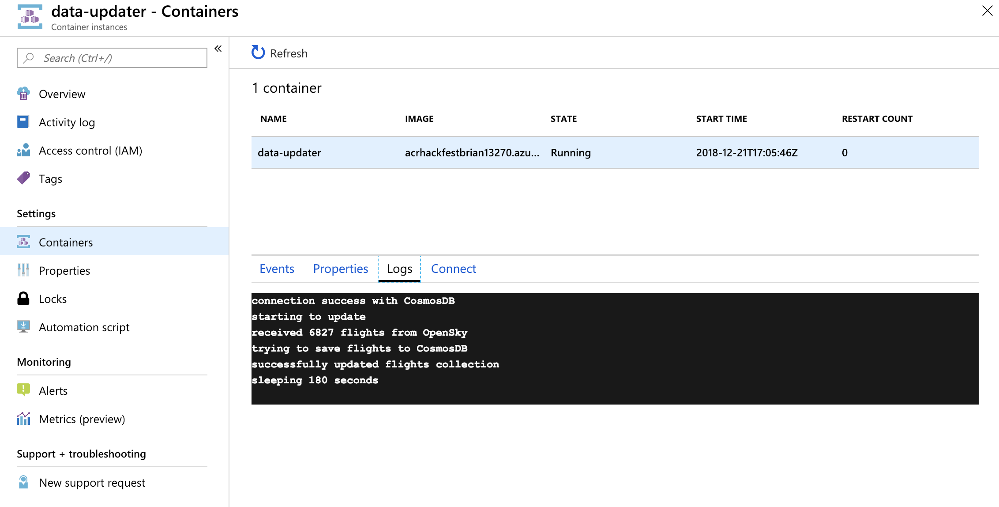

# Lab: Azure Container Instances and AKS Virtual Nodes

## Prerequisites

* Complete previous labs:
    * [Azure Kubernetes Service](../create-aks-cluster/README.md)
    * [Build Application Components in Azure Container Registry](../build-application/README.md)
    * [Helm Setup and Deploy Application](../helm-setup-deploy/README.md)

## Instructions

This lab has 2 components. First we will use Azure Container Instances to deploy a batch process to periodically update our CosmosDB collection. Then we will use the AKS Virtual Nodes feature to scale out our application using ACI.

### Azure Container Instance

1. Create container image for batch processing

    ```bash
    az acr build -t hackfest/data-updater:1.0 -r $ACRNAME --no-logs ~/kubernetes-hackfest/app/data-updater
    ```

2. Configure ACR credentials to be stored in Azure Key Vault

    We are storing our container images securely in ACR. In order to deploy into ACI, we should use a service principal and safely store these creds in Azure Key Vault as a best practice. 

    > Note. For AKS, we stored these credentials in a Kubernetes secret. In a security lab, we show how to use Key Vault here as well. 

    ```bash
    # create azure key vault instance
    AKV_NAME=keyvault${UNIQUE_SUFFIX}
    echo $AKV_NAME
    echo export AKV_NAME=keyvault${UNIQUE_SUFFIX} >> ~/.bashrc

    az keyvault create -g $RGNAME -n $AKV_NAME
    ```

    Next create a service principal, store it's password in AKV (the registry *password*)
    ```bash
    # note that we can use the service principal created in lab 1 for this.
    az keyvault secret set \
    --vault-name $AKV_NAME \
    --name $ACRNAME-pull-pwd \
    --value $(az ad sp create-for-rbac \
                --name $ACRNAME-pull \
                --scopes $(az acr show --name $ACRNAME --query id --output tsv) \
                --role reader \
                --query password \
                --output tsv)
    ```

    Next, store service principal ID in AKV (the registry *username*)
    ```bash
    az keyvault secret set \
    --vault-name $AKV_NAME \
    --name $ACRNAME-pull-usr \
    --value $(az ad sp show --id http://$ACRNAME-pull --query appId --output tsv)
    ```

3. Gather environment variables needed for running ACI

    This container uses the following envvars to run. You may need to look these up in the Azure portal or use commands from lab 2 to obtain.

    ```bash
    # set these values for your lab
    export MONGODB_USER=
    export MONGODB_PASSWORD=
    export APPINSIGHTS_INSTRUMENTATIONKEY=
    ```

4. Create ACI using the Azure CLI. Note: You can also complete this step using the Azure portal

    ```bash
    az container create \
    --name data-updater \
    --image $ACRNAME.azurecr.io/hackfest/data-updater:1.0 \
    --resource-group $RGNAME \
    --location eastus \
    --cpu 1 --memory 2 \
    --registry-login-server $ACRNAME.azurecr.io \
    --registry-username $(az keyvault secret show --vault-name $AKV_NAME -n $ACRNAME-pull-usr --query value -o tsv) \
    --registry-password $(az keyvault secret show --vault-name $AKV_NAME -n $ACRNAME-pull-pwd --query value -o tsv) \
    --environment-variables MONGODB_USER=$MONGODB_USER \
    MONGODB_PASSWORD=$MONGODB_PASSWORD \
    APPINSIGHTS_INSTRUMENTATIONKEY=$APPINSIGHTS_INSTRUMENTATIONKEY \
    UPDATE_INTERVAL=180000
    ```

    > Note: we are also using an envvar called UPDATE_INTERVAL to determine how often the update will occur in milliseconds.

5. Check the status of your ACI in the Azure portal. Validate the ACI logs and verify your Flights collection is being updated.

    


### Azure Kubernetes Service Virtual Nodes


## Troubleshooting / Debugging

* 

## Docs / References

* ACI Docs. https://docs.microsoft.com/en-us/azure/container-instances/container-instances-overview 
* AKS Virtual Nodes. https://docs.microsoft.com/en-us/azure/aks/virtual-nodes-cli
* Virtual Kubelet. https://github.com/virtual-kubelet/virtual-kubelet 
* Using ACI with ACR. https://docs.microsoft.com/en-us/azure/container-instances/container-instances-using-azure-container-registry 