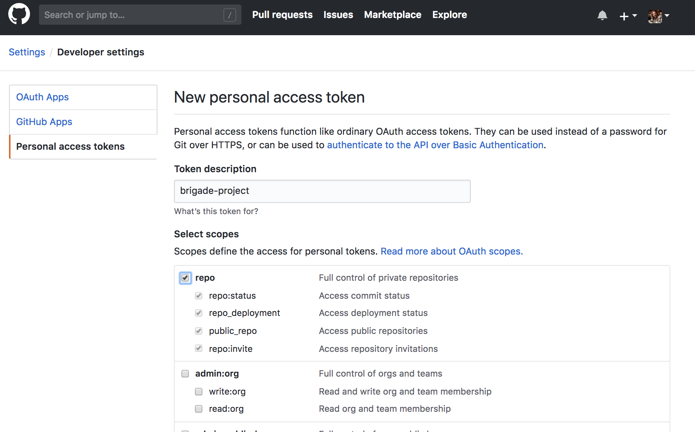
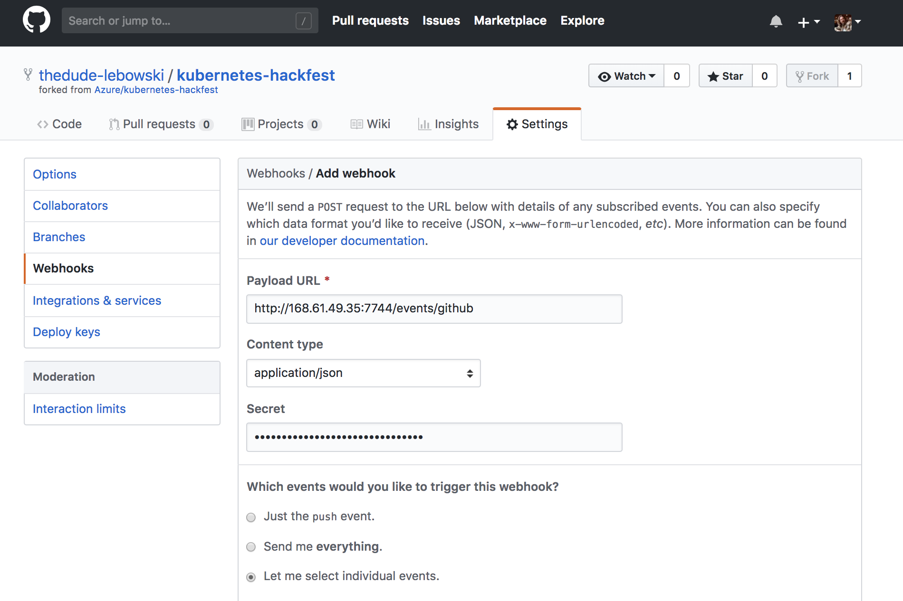

# Lab: CI/CD with Brigade and Helm

This workshop will guide you through building a Continuous Integration (CI) and Continuous Deployment (CD) pipeline using the open source platform Brigade. The pipeline will utilize Azure Container Registry to build the images and Helm for application updating.

## Prerequisites

* Complete previous labs:
    * [Azure Kubernetes Service](../../create-aks-cluster/README.md)
    * [Build Application Components in Azure Container Registry](../../build-application/README.md)
    * [Helm Setup and Deploy Application](../../helm-setup-deploy/README.md)

## Instructions

The general workflow/result will be as follows:

* Push code to source control (Github)
* Trigger a continuous integration (CI) build pipeline when project code is updated via Git
* Package app code into a container image (Docker Image) created and stored with Azure Container Registry
* Trigger a continuous deployment (CD) release pipeline upon a successful build
* Deploy container image to AKS upon successful a release (via Helm chart)
* Rinse and repeat upon each code update via Git

#### Setup Github Repo

In order to trigger this pipeline you will need your own Github account and forked copy of this repo. Log into Github in the browser and get started. 

1. Broswe to https://github.com/azure/kubernetes-hackfest and click "Fork" in the top right. 

    

2. Grab your clone URL from Github which will look something like: `https://github.com/thedude-lebowski/kubernetes-hackfest.git`

    

3. Clone your repo in Azure Cloud Shell.

    > Note: If you have cloned the repo in earlier labs, the directory name will conflict. You can either delete the old one or just rename it before this step. 

    ```bash
    git clone https://github.com/<your-github-account>/kubernetes-hackfest.git

    cd kubernetes-hackfest
    ```

#### Setup Brigade

1. Update helm repo

    ```bash
    helm repo add brigade https://azure.github.io/brigade
    ```

2. Install brigade chart into it's own namespace

    ```bash
    kubectl create ns brigade

    helm install -n brigade brigade/brigade --namespace brigade

    kubectl get pod,svc -n brigade

    NAME                                             READY     STATUS    RESTARTS   AGE
    pod/brigade-brigade-api-789bf79dbd-t2p8g         1/1       Running   0          25s
    pod/brigade-brigade-ctrl-5d85d9f5bc-9zd26        1/1       Running   0          25s
    pod/brigade-brigade-github-gw-65f45c69c7-kbvhg   1/1       Running   0          25s

    NAME                                TYPE           CLUSTER-IP     EXTERNAL-IP   PORT(S)          AGE
    service/brigade-brigade-api         ClusterIP      10.0.140.170   <none>        7745/TCP         25s
    service/brigade-brigade-github-gw   LoadBalancer   10.0.44.207    <pending>     7744:30858/TCP   25s
    ```

#### Setup Brigade Project

Brigade uses projects to define the configuration for pipelines. Brigade Projects are also installed with a Helm chart. In this section, we will create a YAML file to configure the brigade project Helm chart.

1. Create a brigade project YAML file.

    * Create a file called ```brig-proj-hackfest.yaml```  Keep this file local on the cloud shell. This is a sensitive file and should not be pushed to Github.

        > Note: In the latest Azure Cloud Shell, there is a built-in editor to allow easy file editing without leaving the shell.

    * Add the contents below to start your file

        ```yaml
        project: 
        repository: 
        cloneURL: 
        sharedSecret: 
        github:
            token: 
        secrets:
            acrServer: 
            acrName: 
            appId: 
            password: 
            tenant: 
        ```

    * Edit the values from above to match your Github account (example below)
        * project: thedude-lebowski/kubernetes-hackfest
        * repository: github.com/thedude-lebowski/kubernetes-hackfest
        * cloneURL: https://github.com/thedude-lebowski/kubernetes-hackfest.git
        * sharedSecret: useSomethingSuperSecretForThis!

    * Create a Github token and update the ```brig-proj-hackfest.yaml```
        * In your Github, click on `Settings` and `Developer settings`
        * Select `Personal sccess tokens`
        * Select `Generate new token`
            

        * Enter `brigade-project` for the description and give access to the `repo`
            

        > Note: More details on Brigade and Github integration are here: https://github.com/Azure/brigade/blob/master/docs/topics/github.md 

        * Be sure to copy the access token value and add it to your project YAML file.

    * Gather your ACR info from the Azure portal. Edit the ```brig-proj-hackfest.yaml``` for these values
        * acrServer (something like )
        * acrName (something like myacr)

    * Create an Azure service principal with rights to your ACR Resource Group. 
        * You can get your subscription ID in the Azure portal or running `az account list -o table`

            ```bash
            export AZSUBID="471d33fd-a776-405b-947c-467c291dc741"
            export RGNAME=kubernetes-hackfest

            az ad sp create-for-rbac --role="Contributor" --scopes="/subscriptions/$AZSUBID/resourceGroups/$RGNAME"

            # mock values:
            {
                "appId": "11pp69f2-2d9a-4c46-921c-99058df3738z",
                "displayName": "azure-cli-2018-01-10-21-20-18",
                "name": "http://azure-cli-2018-01-10-21-20-18",
                "password": "11111fe4-07dd-4adb-b984-d25f030f7a92",
                "tenant": "99f999bf-99f1-41af-99ab-2d7cd011ab12"
            }
            ```
        * Be sure to grant the service principal rights to the RG where your ACR is located.
        * Use the output to set the values in the ```brig-proj-hackfest.yaml``` file

    * After the above steps, your file will look like the below (values are not valid for realz)

        ```yaml
        project: thedude-lebowski/kubernetes-hackfest
        repository: github.com/thedude-lebowski/kubernetes-hackfest
        cloneURL: https://github.com/thedude-lebowski/kubernetes-hackfest.git
        sharedSecret: useSomethingSuperSecretForThis!
        github:
            token: 1yyy8a4d1c08004rrttt685980814d3f358e5b0z
        secrets:
            acrServer: myacr.azurecr.io
            acrName: myacr
            appId: 11pp69f2-2d9a-4c46-921c-99058df3738z
            password: 11111fe4-07dd-4adb-b984-d25f030f7a92
            tenant: 99f999bf-99f1-41af-99ab-2d7cd011ab12
        ```

2. Create your brigade project

    ```bash
    # from the directory where your file from step #1 was created

    helm install --name brig-proj-hackfest brigade/brigade-project -f brig-proj-hackfest.yaml --namespace brigade
    ```

    > Note: There is a ```brig``` CLI client that allows you to view your brigade projects. More details here: <https://github.com/Azure/brigade/tree/master/brig>

#### Setup Brigade Pipeline

To save time, we will only deploy the web-ui application in this lab. 

1. In the Azure cloud shell, ```cd ~/kubernetes-hackfest``` and create a file called ```brigade.js```

2. Edit `brigade.js` in cloud shell

3. Paste the contents from the sample [brigade.js](./brigade.js) file in this file

4. Review the pipeline steps in the javascript

5. Commit the new file to your Github repository

    ```bash
    git add .
    git add -A
    git commit -m "added brigade pipeline script"
    git push
    ```

    > Note that we are using the master branch here. Normally we would use other branches and PR's. For simplicity, we are using master just for this lab.

#### Configure Github Webhook

1. Get a URL for your Brigade Gateway

    ```bash
    kubectl get service brigade-brigade-github-gw -n brigade

    NAME                 TYPE           CLUSTER-IP    EXTERNAL-IP     PORT(S)          AGE
    brigade-brigade-gw   LoadBalancer   10.0.45.233   13.67.129.228   7744:30176/TCP   4h

    # use these commands to create the full URL

    export GH_WEBHOOK=http://$(kubectl get svc brigade-brigade-github-gw -n brigade -o jsonpath='{.status.loadBalancer.ingress[0].ip}'):7744/events/github

    echo $GH_WEBHOOK
    ```

    The webhook URL should look something like: http://13.67.129.228:7744/events/github You will use this in the next step.

2. In your forked Github repo, click on Settings

3. Click Webhooks

4. Click `Add webhook`

5. Set the `Payload URL` to the URL created in step 1

6. Set the `Content type` to `application/json`

7. Set the `Secret` to the value from your `brig-proj-hackfest.yaml` called "sharedSecret"

8. Set the `Which events...` to `Let me select individual events` and check `Push` and `Pull request`

    

9. Click the `Add webhook` button

#### Test the CI/CD Pipeline

1. Make a code change in the web-ui application source code.

2. Push the update to Github and validate the build in brigade.

    ```bash
    kubectl get pod -n brigade

    NAME                                                READY     STATUS      RESTARTS   AGE
    brigade-brigade-api-789bf79dbd-t2p8g                1/1       Running     0          1d
    brigade-brigade-ctrl-5d85d9f5bc-txwz4               1/1       Running     0          3h
    brigade-brigade-github-gw-65f45c69c7-8r2qw          1/1       Running     0          3h
    brigade-worker-01cjzdd4dnssjp50chw2fps6h3           0/1       Completed   0          31m
    brigade-worker-01cjzdn7d650jff10a04292pjs           0/1       Completed   0          1m
    job-runner-acr-builder-01cjzdd4dnssjp50chw2fps6h3   0/1       Completed   0          31m
    job-runner-acr-builder-01cjzdn7d650jff10a04292pjs   0/1       Completed   0          1m
    job-runner-helm-01cjzdd4dnssjp50chw2fps6h3          0/1       Completed   0          31m
    job-runner-helm-01cjzdn7d650jff10a04292pjs          0/1       Completed   0          25s

    kubectl logs job-runner-helm-01cjzdn7d650jff10a04292pjs -n brigade
    ```

3. Check the `web-ui` application pods and ensure they were updated with the new imageTag created in the build.

4. If it worked, celebrate and go get a beer.

#### Add Kashti Web Dashboard (Optional)

* [Add these steps](https://github.com/Azure/kashti)

## Troubleshooting / Debugging

* N/A

## Docs / References

* [Brigade web site](http://brigade.sh)
* [Brigade Source] https://github.com/Azure/brigade 
* [Original Blog Post](https://open.microsoft.com/2017/10/23/announcing-brigade-event-driven-scripting-kubernetes)

#### Next Lab: [Networking](../../networking/README.md)