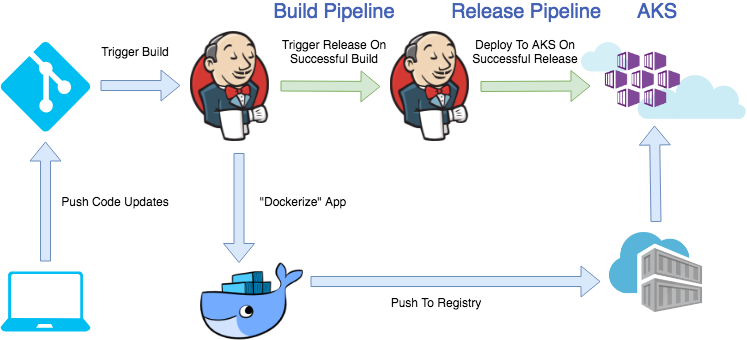
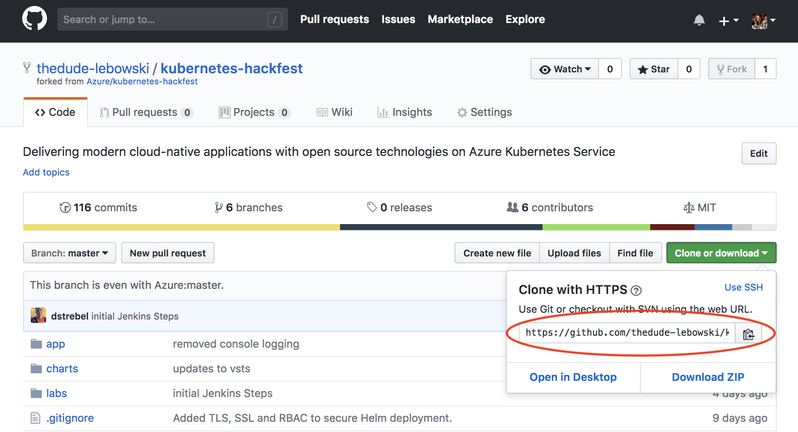
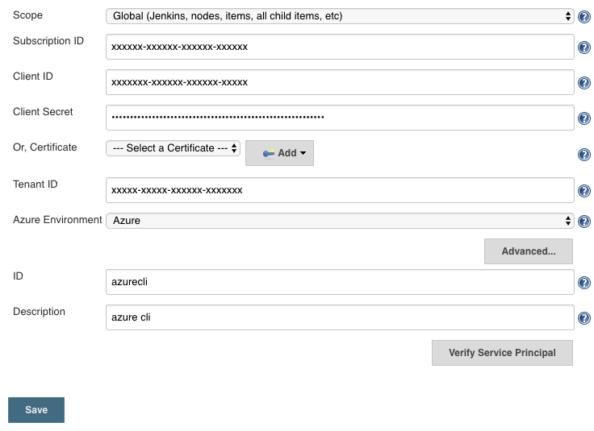
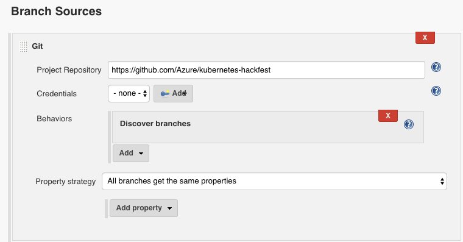
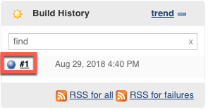
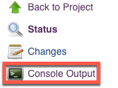

*** Work IN Progress ***
# Lab: Jenkins CI/CD

This workshop will guide you through building Continuous Integration (CI) and Continuous Deployment (CD) pipelines with Visual Studio Team Services (VSTS) for use with Azure Kubernetes Service. The pipeline will utilize Azure Container Registry to build the images and Helm for application updating. 

## Prerequisites 

* Clone this repo in Azure Cloud Shell.
* Complete previous labs:
    * [Azure Kubernetes Service](../create-aks-cluster/README.md)
    * [Build Application Components in Azure Container Registry](../build-application/README.md)
    * [Helm Setup and Deploy Application](../helm-setup-deploy/README.md)

## Instructions

The general workflow/result will be as follows:

- Push code to source control (Github)
- Trigger a continuous integration (CI) build pipeline when project code is updated via Git
- Package app code into a container image (Docker Image) created and stored with Azure Container Registry
- Trigger a continuous deployment (CD) release pipeline upon a successful build
- Deploy container image to AKS upon successful a release (via Helm chart)
- Rinse and repeat upon each code update via Git
- Profit




#### Setup Github Repo

In order to trigger this pipeline you will need your own Github account and forked copy of this repo. Log into Github in the browser and get started. 

1. Broswe to https://github.com/azure/kubernetes-hackfest and click "Fork" in the top right.

    

2. Grab your clone URL from Github which will look something like: `https://github.com/thedude-lebowski/kubernetes-hackfest.git`

    

3. Clone your repo in Azure Cloud Shell.

    > Note: If you have cloned the repo in earlier labs, the directory name will conflict. You can either delete the old one or just rename it before this step.

    ```bash
    git clone https://github.com/<your-github-account>/kubernetes-hackfest.git

    cd kubernetes-hackfest/labs/cicd-automation/jenkins
    ```

4. Modify the Jenkinsfile pipeline

    The pipeline file references your Azure Container Registry in a variable. Edit the `labs/cicd-automation/jenkins/Jenkinsfile` file and modify line 4 of the code: 
    ```
    def  ACRNAME = 'youracrname'
    ```

#### Deploy Jenkins Helm Chart

1. Initialize Helm With RBAC

    > Note: You may have already installed Helm in the earlier lab. You can validate with `helm version`

   ```bash
   kubectl apply -f helm-rbac.yaml
   ```
   
   ```bash
   helm init --service-account tiller
   ```

   ```bash
   helm install stable/jenkins --name jenkins -f values.yaml
   ```

   This will take a couple of minutes to fully deploy

2. Get credentials and IP to Login To Jenkins
   ```bash
   printf $(kubectl get secret --namespace default jenkins-jenkins -o jsonpath="{.data.jenkins-admin-password}" | base64 --decode);echo
   ```
   ```bash
   export SERVICE_IP=$(kubectl get svc --namespace default jenkins-jenkins --template "{{ range (index .status.loadBalancer.ingress 0) }}{{ . }}{{ end }}")
   ```
   ```bash
   echo http://$SERVICE_IP:8080/login
   ```

   Login with the password from previous step and the username: admin

   > Note: The Jenkins pod can take a couple minutes to start. Ensure it is `Running` prior to attempting to login.

#### Configure Azure Integration In Jenkins

1. Browse to Jenkins Default Admin Screen
2. Click on `Credentials`
3. Select `System` under Credentials
4. On the right side click the `Global Credentials` drop down and select `Add Credentials`
5. Enter the following: *Example Below*
    * Kind = Azure Service Principal
    * Scope = Global
    * Subscription ID = use Subscription ID from cluster creation
    * Client ID =  use Subscription ID from cluster creation
    * Client Secret = use Client Secret from cluster creation
    * Tenant ID = use Tenant ID from cluster creation
    * Azure Environment = Azure
    * Id = azurecli
    * Description = Azure CLI Credentials
6. Click `Verify Service Principal`
7. Click `Save`
   
   

#### Edit Jenkinsfile Variable
1. Edit Jenkinsfile  with the following command `code Jenkinsfile`
2. Replace the following variable with the Azure Container Registry created previously
   * def  ACRNAME = '<container_registry_name>'

#### Create Jenkins Multibranch Pipeline

1. Open Jenkins Main Admin Interface
2. Click `Create New Project`
3. Enter "aks-hackfest" for Item Name
4. Select `Multibrach Pipeline`
5. Under Branch Sources `Click Add` -> `Git`
   
   
6. In Project Replository enter `your forked git repo`
7. In Build Configuration -> Script Path -> use the following path 
   
   `labs/cicd-automation/jenkins/Jenkinsfile`
   
   
8. Scroll to bottom of page and click `Save`

#### Run Jenkins Multibranch Deployment

1. Go back to Jenkins main page
2. Select the newly created pipeline
3. Select `Scan Multibranch Pipeline Now`

This will scan your git repo and run the Jenkinsfile build steps. It will clone the repository, build the docker image, and then deploy the app to your AKS Cluster.

#### View Build Console Logs

1. Select the `master` under branches

   
2. Select `build #1` under Build History

   
3. Select `Console Output`

   
4. Check streaming console output for any errors

#### Verify Deployed Application

1. Confirm pods are running 
   ```bash
   kubectl get pods
   ```
2. Get service IP of deployed app
   ```bash
   kubectl get service/service-tracker-ui
   ```
3. Open browser and test application `EXTERNAL-IP:8080`

#### Next Lab: [Networking](../../networking/README.md)
