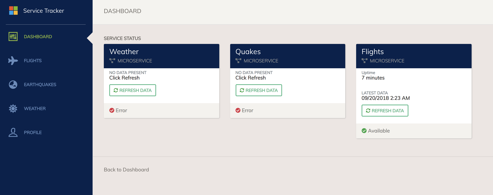

# Lab: Helm Setup and Deploy Application

In this lab we will setup Helm in our AKS cluster and deploy our application with Helm charts.

## Prerequisites 

* Clone this repo in Azure Cloud Shell.
* Complete previous labs:
    * [Azure Kubernetes Service](../create-aks-cluster/README.md)
    * [Build Application Components in Azure Container Registry](../build-application/README.md)

## Instructions

1. Initialize Helm
    
    Helm helps you manage Kubernetes applications — Helm Charts helps you define, install, and upgrade even the most complex Kubernetes application. Helm has a CLI component and a server side component called Tiller. 
    * Initialize Helm and Tiller:

        ```bash
        cd ~/kubernetes-hackfest
        kubectl apply -f ./labs/helm-setup-deploy/rbac-config.yaml
        helm init --service-account tiller --upgrade
        ```

    * Validate the install (in this case, we are using Helm version 2.9.1):
        ```bash
        helm version
        ```
    
        ```bash
        Client: &version.Version{SemVer:"v2.10.0", GitCommit:"20adb27c7c5868466912eebdf6664e7390ebe710", GitTreeState:"clean"}
        Server: &version.Version{SemVer:"v2.10.0", GitCommit:"20adb27c7c5868466912eebdf6664e7390ebe710", GitTreeState:"clean"}
        ```

        > It can take a minute or so for Tiller to start

2. Create Application Insights Instance

    * In your Azure portal, click "Create a resource", select "Developer tools", and choose "Application Insights"
    * Pick a unique name (you can use the unique identifier created in the 1st lab)
    * Use "Node.js Application" for the app type
    * Select "kubernetes-hackfest" for the Resource Group
    * Use "East US" for location
    * When this is completed, select "All services", and search for "Application Insights" 
    * Select your newly created Application Insights instance
    * On the Overview Page take note of the Instrumentation Key

3. Review the Helm Chart components

    In this repo, there is a folder for `charts` with a sub-folder for each specific app chart. In our case each application has its own chart. 

    The `values.yaml` file has the parameters that allow you to customize release. This file has the defaults, but they can be overridden on the command line. 

    The `templates` folder holds the yaml files for the specific kubernetes resources for our application. Here you will see how Helm inserts the parameters into resources with this bracketed notation: eg -  `{{.Values.deploy.image}}`


4. Customize Chart Parameters

    In each chart we will need to update the values file with our specific Azure Container Registry. 

    * Get the value of your ACR Login Server:

        ```
        az acr list -o table --query "[].loginServer"

        Result
        -------------------
        youracr.azurecr.io

        ```
    
    * Replace the `acrServer` value below with the Login server from previous step. In the Azure Cloud Shell, select the file editor '{}'.  Navigate to the yaml files below.  To save changes, select the elipticals on the right hand side and select Save. You will make this change in all of the charts below (except cache-api)
    
        [charts/service-tracker-ui/values.yaml](../../charts/service-tracker-ui/values.yaml)

        [charts/weather-api/values.yaml](../../charts/weather-api/values.yaml)

        [charts/flights-api/values.yaml](../../charts/flights-api/values.yaml)

        [charts/quakes-api/values.yaml](../../charts/quakes-api/values.yaml)

        [charts/data-api/values.yaml](../../charts/data-api/values.yaml)

        Example:
        ```yaml
        # Default values for chart

        service:
        type: LoadBalancer
        port: 3009

        deploy:
        name: data-api
        replicas: 1
        acrServer: "youracr.azurecr.io"
        imageTag: "1.0"
        containerPort: 3009
        ```

    * Valdiate that the `imageTag` parameter matches the tag you created in Azure Container Registry in the previous lab.

5. Create Kubernetes secrets for access to Cosmos DB and App Insights

    For now, we are creating a secret that holds the credentials for our backend database. The application deployment puts these secrets in environment variables. 

    * Customize these values from your Cosmos DB instance deployed in a previous lab. Use the ticks provided for strings
    
    ```bash
    az cosmosdb list-connection-strings --name $COSMOSNAME --resource-group $RGNAME
    ```

    > Note: the MONGODB_URI should be of this format **(Ensure you add the `/hackfest?ssl=true`)** at the end. 
    
    mongodb://cosmosbrian11199:ctumHIz1jC4Mh1hZgWGEcLwlCLjDSCfFekVFHHhuqQxIoJGiQXrIT1TZTllqyB4G0VuI4fb0qESeuHCRJHA==@acrhcosmosbrian11122.documents.azure.com:10255/<strong style="font-size:24px; font-family:courier; color:#308e48">hackfest</strong>?ssl=true

    ```
    export MONGODB_URI='outputFromAboveCommand'
    ```
    ```bash
    az cosmosdb show --name $COSMOSNAME --resource-group $RGNAME --query "name" -o tsv

    export MONGODB_USER='outputFromAboveCommand'
    ```
    ```bash
    az cosmosdb list-keys --name $COSMOSNAME --resource-group $RGNAME --query "primaryMasterKey" -o tsv

    export MONGODB_PASSWORD='outputFromAboveCommand'
    ```
    
    Use Instrumentation Key from previous exercise:      
    ```bash
    export APPINSIGHTS_INSTRUMENTATIONKEY=''
    ```

    ```bash
    kubectl create secret generic cosmos-db-secret --from-literal=uri=$MONGODB_URI --from-literal=user=$MONGODB_USER --from-literal=pwd=$MONGODB_PASSWORD --from-literal=appinsights=$APPINSIGHTS_INSTRUMENTATIONKEY
    ```


6. Deploy Charts

    Install each chart as below:

    ```
    # Application charts 

    helm upgrade --install data-api ./charts/data-api
    helm upgrade --install quakes-api ./charts/quakes-api
    helm upgrade --install weather-api ./charts/weather-api
    helm upgrade --install flights-api ./charts/flights-api
    helm upgrade --install service-tracker-ui ./charts/service-tracker-ui
    ```

6. Initialize application

    * First check to see if pods and services are working correctly

    ```
    kubectl get pod,svc

    NAME                                      READY     STATUS    RESTARTS   AGE
    pod/data-api-555688c8d-xb76d              1/1       Running   0          1m
    pod/flights-api-69b9d9dfc-8b9z8           1/1       Running   0          1m
    pod/quakes-api-7d95bccfc8-5x9hw           1/1       Running   0          1m
    pod/service-tracker-ui-7db967b8c9-p27s5   1/1       Running   0          54s
    pod/weather-api-7448ff75b7-7bptj          1/1       Running   0          1m

    NAME                         TYPE           CLUSTER-IP     EXTERNAL-IP    PORT(S)          AGE
    service/data-api             LoadBalancer   10.0.89.66     23.96.11.105   3009:31779/TCP   9m
    service/flights-api          LoadBalancer   10.0.210.195   23.96.11.180   3003:30862/TCP   8m
    service/kubernetes           ClusterIP      10.0.0.1       <none>         443/TCP          20h
    service/quakes-api           LoadBalancer   10.0.134.0     23.96.11.127   3003:31950/TCP   8m
    service/service-tracker-ui   LoadBalancer   10.0.90.157    23.96.11.115   8080:32324/TCP   8m
    service/weather-api          LoadBalancer   10.0.179.66    23.96.11.49    3003:31951/TCP   8m
    ```

    * Browse to the web UI

    ```
    kubectl get service service-tracker-ui

    NAME                TYPE           CLUSTER-IP   EXTERNAL-IP     PORT(S)          AGE
    service-tracker-ui  LoadBalancer   10.0.82.74   40.16.218.139   8080:31346/TCP   8m
    ```

    Open the browser to http://40.76.218.139:8080 (your IP will be different #obvious)

    * You will need to click "REFRESH DATA" for each service to load the data sets.

        

    * Browse each map view and have some fun.

## Troubleshooting / Debugging

* Make sure Helm version on the client and server are the same to ensure compatibility.

## Docs / References

* [Helm](http://helm.sh)

#### Next Lab: [CI/CD Automation](labs/cicd-automation/README.md)
