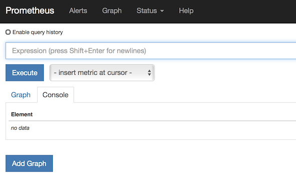
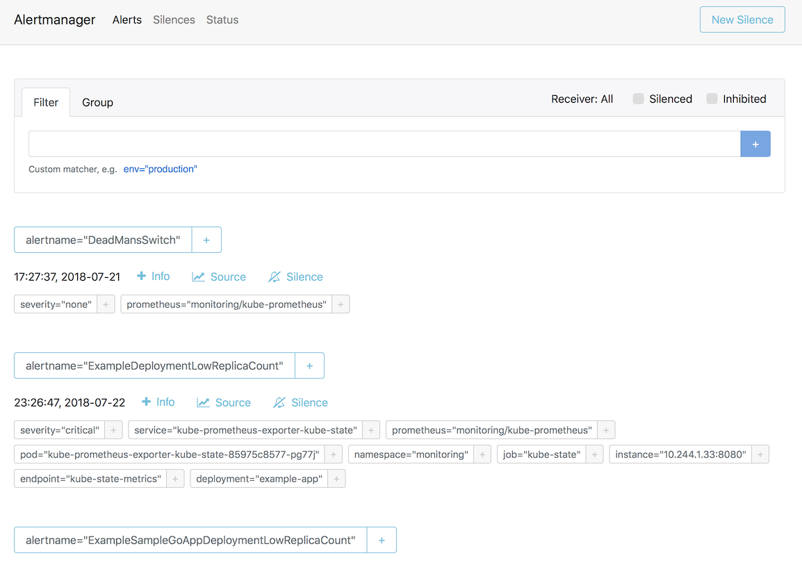
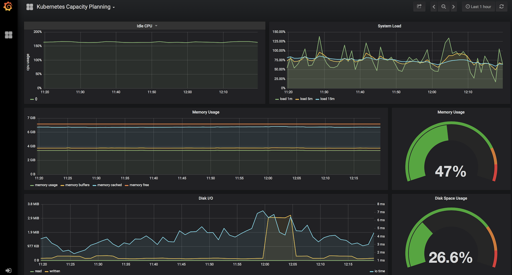
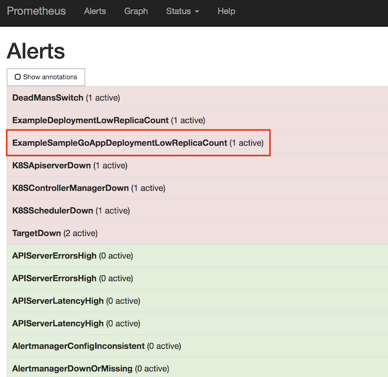
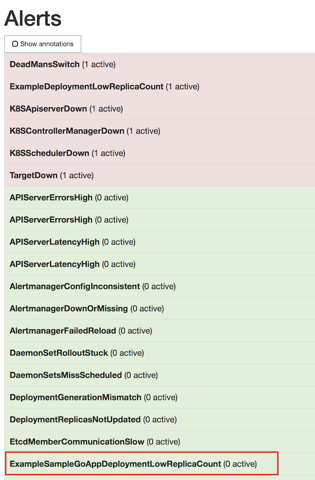

# Lab: Adding Prometheus and Grafana to AKS Cluster

This lab will walkthrough using the Core OS Prometheus Operator to add Monitoring and Visualization capabilities to our AKS Cluster. The Operator will be installed using HELM.


## Prerequisites

* Complete previous labs:
    * [Azure Kubernetes Service](../../create-aks-cluster/README.md)
    * [Build Application Components in Azure Container Registry](../../build-application/README.md)
    * [Helm Setup and Deploy Application](../../helm-setup-deploy/README.md)

## Instructions

1. Configure and Setup Helm to Deploy Prometheus Operator

    ```bash
    # Switch to the lab directory in Azure Cloud Shell
    cd ~/kubernetes-hackfest/labs/monitoring-logging/prometheus-grafana
    ```

    ```bash
    # Create Tiller Service Account and Apply ClusterRoleBinding
    kubectl apply -f prom-rbactillerconfig.yaml

    # Helm was installed previously. Check to make sure it is Running
    helm version
    ```

    > Note: If helm is not installed, run: ```helm init --service-account=tiller```

2. Deploy Prometheus Operator

    ``` bash
    # Add the Core OS Helm Reop in case it is not already installed
    helm repo add coreos https://s3-eu-west-1.amazonaws.com/coreos-charts/stable/
    # Create a new Monitoring Namespace to deploy Prometheus Operator too
    kubectl create namespace monitoring
    # Install Prometheus Operator
    # NOTE: The output of this command will say failed because there is a job (pod)
    # running and it takes a while to complete. It is ok, proceed to next step.
    helm install coreos/prometheus-operator --version 0.0.27 --name prometheus-operator --namespace monitoring
    kubectl -n monitoring get all -l "release=prometheus-operator"
    # Install Prometheus Configuration and Setup for Kubernetes
    helm install coreos/kube-prometheus --version 0.0.95 --name kube-prometheus --namespace monitoring
    kubectl -n monitoring get all -l "release=kube-prometheus"
    # Check to see that all the Pods are running
    kubectl get pods -n monitoring
    # Other Useful Prometheus Operator Resources to Peruse
    kubectl get prometheus -n monitoring
    kubectl get prometheusrules -n monitoring
    kubectl get servicemonitor -n monitoring
    kubectl get cm -n monitoring
    kubectl get secrets -n monitoring
    ```

3. Update Prometheus Operator Deployment to Correct Prometheus Metrics Capture

    ```bash
    # Edit kubelet to be http instead of https (Fixes Prometheus kubelet API Metrics)
    # Edit kube-dns to update Prometheus ENV (Fixes DNS API Metrics)
    # https://github.com/coreos/prometheus-operator/issues/1522
    kubectl edit servicemonitors kube-prometheus-exporter-kubelets -n monitoring
    kubectl patch deployment kube-dns-v20 -n kube-system --patch "$(cat prom-graf-kube-dns-metrics-patch.yaml)"
    ```

4. Expose Services to Public IP's

    ```bash
    # use your VI skills to change the below snippet. It should be "LoadBalancer" and not "ClusterIP"

    kubectl edit service kube-prometheus -n monitoring
    ```

    ```yaml
    spec:
      clusterIP: 10.0.79.78
      ports:
      - name: http
        port: 9090
        protocol: TCP
        targetPort: 9090
      selector:
        app: prometheus
        prometheus: kube-prometheus
      sessionAffinity: None
      type: LoadBalancer
    ```

    ```bash
    # repeat for Alert Manager
    kubectl edit service kube-prometheus-alertmanager -n monitoring
    ```

    ```bash
    # repeat for Grafana
    kubectl edit service kube-prometheus-grafana -n monitoring
    ```

    > Note: These settings should not generally be used in production. The endpoints should be secured behind an Ingress. This just aides the lab experience. 

5. Interact with Prometheus (Prometheus and Alert Manager Dashboards)

    ```bash
    # Get your public IP address for the Prometheus dashboard (if <pending>, you must wait...)
    kubectl get service kube-prometheus -n monitoring
    ```

    Open up a brower to http://<your-public-ip>:9090 and you will see the Prometheus dashboard

    * Screenshot of Default Prometheus UI

    

    ```bash
    # Get your public IP address for the Prometheus Alert Manager (if <pending>, you must wait...)
    kubectl get service kube-prometheus-alertmanager -n monitoring
    ```

    Open up a brower to http://<your-public-ip>:9093 and you will see the Prometheus dashboard

    * Screenshot of Default Alert Manager UI

    

6. Interact with Grafana Dashboard

    ```bash
    # Get your public IP address for Grafana (if <pending>, you must wait...)
    kubectl get service kube-prometheus-grafana -n monitoring
    ```

    Open up a brower to http://<your-public-ip>:80 and you will see the Prometheus dashboard

    * Screenshot of Kubernetes Capacity Planning Dashboard

    

7. Deploy Sample App with Integrated and Custom Prometheus Metrics

    * Create Namespace for Sample GO App
    ```bash
    # Create custom Namespace to deploy sample app to.
    kubectl create namespace sample-app
    ```
    * Build [Sample GO App](../../../app/sample-go/README.md) Container & Update Deployment Manifest
    ```bash
    # 1. Use ACR Build to create Container and Push to ACR
    # 2. Update Container Image in Deployment manifest (prom-graf-sample-go-app.yaml) 
    # Deploy the Sample GO Application with Updated Container Image
    kubectl apply -f prom-graf-sample-go-app.yaml -n sample-app
    # Deploy the ServiceMonitor to Monitor the Sample GO App
    kubectl apply -f prom-graf-servicemonitor.yaml -n monitoring
    # Deploy the ConfigMap to Raise Alerts for the Sample GO App
    kubectl apply -f prom-graf-configmap.yaml -n monitoring
    ```
    * If there is interest in how Prometheus Metrics and Custom Metrics can be added to an existing application take a look at the [GO Code](../../../app/sample-go/app.go).

8. Check Metrics and Alerts are Working for Sample GO App

    * Using the technique above, port-forward to the Prometheus Dashboard.
    * Check custom metric in the deployed sample GO App:

    

    * Check Replica Count custom alert for the sample GO App:

    

9. Fix Replica Count Custom Alert

    * Scale the Deployment to 3 replicas to stop the Alert from FIRING.
    ```bash
    kubectl scale deploy sample-go -n sample-app --replicas=3
    ```
    * Using the technique above, port-forward to the Prometheus Dashboard and check that the Alert is now Green and not FIRING. Be patient, this will take a couple of minutes for the metrics to be updated and the evaluation process to respond accordingly.

    

## Troubleshooting / Debugging

* Checking Default Prometheus Configuration

```bash
kubectl get secret prometheus-kube-prometheus -n monitoring -o json | jq -r '.data["prometheus.yaml"]' | base64 --decode
```

* Checking Default Prometheus Alert Manager Configuration

```bash
kubectl get secret alertmanager-kube-prometheus -n monitoring -o json | jq -r '.data["alertmanager.yaml"]' | base64 --decode
```

* Checking Custom Deployed ServiceMonitor (Sample GO App) Configuration

```bash
k get secret prometheus-kube-prometheus -n monitoring -o json | jq -r '.data["prometheus.yaml"]' | base64 --decode | grep "sample-go"
```

## Docs / References

* [Core OS Prometheus Operator](https://github.com/coreos/prometheus-operator/blob/v0.17.0/Documentation/user-guides/getting-started.md)
* [Crash Course to Monitoring K8s](https://www.sumologic.com/blog/cloud/how-to-monitor-kubernetes/)
* [Prometheus Operator Alerting](https://github.com/coreos/prometheus-operator/blob/v0.17.0/Documentation/user-guides/alerting.md)

#### Next Lab: [Service Mesh w/ Distributed Tracing](../../servicemesh-tracing/README.md)