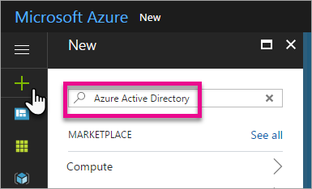
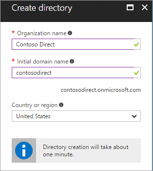

# Lab: Create AKS Cluster integrated with Azure AD for RBAC

This lab creates an AKS Cluster with Azure AD Integration for RBAC.

## Instructions

1. Need Global Admin Permissions to an Existing Azure AD

    There are two options here. If you have global admin privileges to an existing Azure AD and you are ok with creating new Application Registrations then you can proceed to step 3. If you do not have access to an existing Azure AD, or you want to segregate the users for testing purposes, you need to create a new Azure AD via the Azure Portal.

2. Create new Azure AD Tenant

    * Sign-in to the Azure Portal and click on the + sign to create a new resource
    * Search for Azure Active Directory

    

    * Select Azure AD in the Search Result

    

    * Select Create
    * Provide Organization Name & Domain Name and then select **Create**

    

3. Create Application Registrations for Server and Client

    * [Create Server Application](https://docs.microsoft.com/en-us/azure/aks/aad-integration#create-server-application)
    ```bash
    # Set Azure AD Server Application ID and Secret
    SERVER-APP-ID=""
    SERVER-APP-SECRET=""
    ```
    * [Create Client Application](https://docs.microsoft.com/en-us/azure/aks/aad-integration#create-client-application)
    ```bash
    # Set Azure AD Client Application ID
    CLIENT-APP-ID=""
    AZUREAD-TENANT-ID=""
    ```
    * Get Azure AD Tenant ID (tenantId)

    ```bash
    az account list
    # Set Azure AD Tenant ID
    AZUREAD-TENANT-ID=""
    ```

4. Create AKS Cluster with Azure AD RBAC

    ```bash
    # Create Resource Group
    USERINITIALS="<REPLACE-WITH-USER-INITIALS>"
    RG="${USERINITIALS}aksrbac-rg"
    LOC="eastus"
    NAME="${USERINITIALS}aksrbac"
    az group create --name $RG --location $LOC

    PATH_TO_SSH_PUBLICKEY="~/.ssh/id_rsa.pub"
    # Create AKS with RBAC Cluster
    az aks create -g $RG -n $NAME --enable-rbac \
        -k 1.10.3 --node-count 1 --ssh-key-value $PATH_TO_SSH_PUBLICKEY \
        --aad-server-app-id $SERVER-APP-ID \
        --aad-server-app-secret $SERVER-APP-SECRET \
        --aad-client-app-id $CLIENT-APP-ID \
        --aad-tenant-id $AZUREAD-TENANT-ID --no-wait
    ```

5. Create Two User Accounts in Azure AD

    * Name the first account aksadmin
    * Name the second account aksuser
    * Click [here](https://docs.microsoft.com/en-us/power-bi/developer/create-an-azure-active-directory-tenant#create-some-users-in-your-azure-active-directory-tenant) for an example of how to create users in Azure AD.

6. Create RBAC Binding to the two users created

    * Update the user name in the [aksrback-clusteradmin.yaml](aksrback-clusteradmin.yaml) with the aksadmin user.
    * Update the user name in the [aksrback-viewdefault.yaml](aksrback-viewdefault.yaml) with the aksuser user.
    ```bash
    az aks get-credentials -g $RG -n $NAME --admin
    kubectl apply -f aksrbac-clusteradmin.yaml
    kubectl apply -f aksrbac-viewdefault.yaml
    ```

7. Get New AKS Cluster Credentials for use with Azure AD

    * Pull down the Azure AD Cluster Credentials
    ```bash
    az aks get-credentials -g $RG -n $NAME
    ```

    * Try to get the list of AKS Nodes, this should prompt for Credentials

    ```bash
    # If you login with the aksadmin account you will be able to see the nodes.
    # If you login with the aksuser account the request will be denied.
    kubectl get nodes
    ```

## Troubleshooting / Debugging

* Check to make sure that the correct Azure AD Permissions were selected and the **Grant Permissions** step was executed when creating the Server and Client Azure AD Application Registrations.
* Check to make sure the correct Application IDs, Secrets and Tenant ID were used when creating the cluster.
* Check to make sure the correct UPNs were used when creating the ClusterRoleBinding and RoleBinding.

## Docs / References

* [What is an Azure AD Tenant?](https://msdn.microsoft.com/library/azure/jj573650.aspx#Anchor_0)
* [Creating Azure AD Users](https://docs.microsoft.com/en-us/power-bi/developer/create-an-azure-active-directory-tenant#create-some-users-in-your-azure-active-directory-tenant)
* [Kubernetes RBAC Authorization](https://kubernetes.io/docs/reference/access-authn-authz/rbac/)
